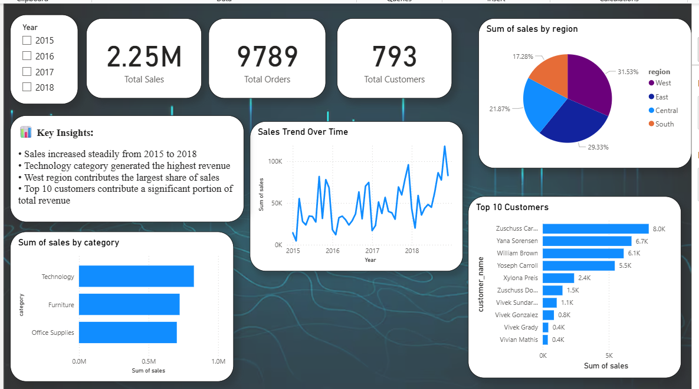

# 📊 E-Commerce Sales Analysis

## 🔍 Overview
This project analyzes e-commerce sales data to uncover business insights and trends using Python, SQL, and Power BI.

---

## 🛠️ Tools Used
- Python (Pandas)
- SQL (MySQL)
- Power BI

---

## 📈 Project Steps
1. Data Cleaning using Python (handled missing values, formatted dates)
2. Data Analysis using SQL (queries for revenue, customers, trends)
3. Data Visualization using Power BI (interactive dashboard)

---

## 📊 Key Insights
- Sales increased steadily from 2015 to 2018
- Technology category generated the highest revenue
- West region contributed the most sales
- Top 10 customers contributed a significant share of revenue

---

## 📷 Dashboard

---

## 🚀 Outcome
This project demonstrates end-to-end data analysis from raw data to business insights.
